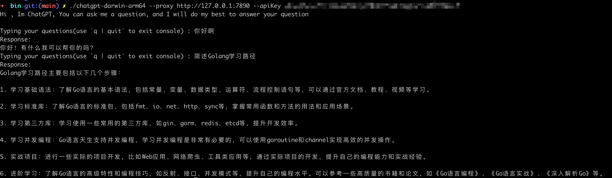
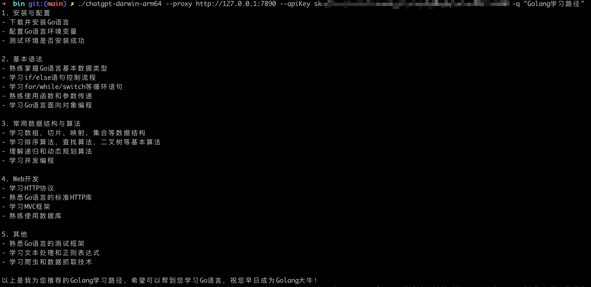

ChatGPT-Cli
======================
This is A ChatGPT Client

A client for ChatGPT (https://chat.openai.com)

Install
----------------------

    git clone https://github.com/SakuraAxy/ChatGPT-Cli.git

Request for API from OpenAI
----------------------
Request your OpenAPI key in https://beta.openai.com/account/api-keys

Usage
----------------------
For Mac ARM64

    ./bin/chatgpt-darwin-arm64 --proxy YOUR_PROXY --apiKey YOUR_OPENAI_API_KEY [-q 'Hi']

For Mac AMD64

    ./bin/chatgpt-darwin-amd64 --proxy YOUR_PROXY --apiKey YOUR_OPENAI_API_KEY [-q 'Hi']

For Windows amd64

    ./bin/chatgpt-windows-amd64 --proxy YOUR_PROXY --apiKey YOUR_OPENAI_API_KEY [-q 'Hi']
For linux amd64

    ./bin/chatgpt-linux-amd64 --proxy YOUR_PROXY --apiKey YOUR_OPENAI_API_KEY [-q 'Hi']

Effect
----------------------
### Interactive

### Command style

